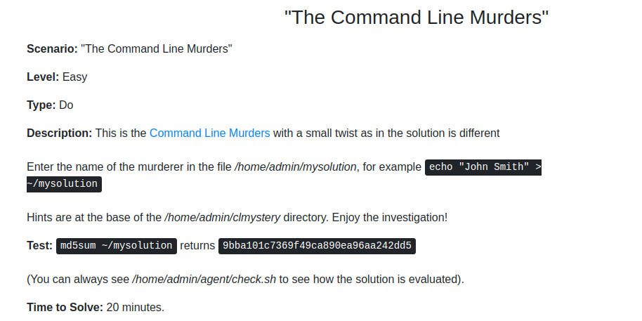

# Troubleshooting Scenarios

## Easy


```bash
lsof -f | grep bad.log
kill <process_id>
```


```bash
more_repeat_ip=$(cut -f 1 -d " " /home/admin/access.log | sort | uniq -c | sort | tail -n 1)
echo $more_repeat_ip | cut -f 2 -d " " > /home/admin/highestip.txt
```


```bash
cd /home/admin
grep Alice *.txt | wc -l #return 411
grep Alice *.txt | cut -f 1 -d "." | sort | uniq -c | sort #file is 1342-0
grep -A 1 Alice 1342-0.txt #return 156 (-A 1 is next line from grep)
echo -n 411 > /home/admin/solution; echo 156 >> /home/admin/solution
```



```bash
cd clmystery
cat instructions
cd mystery
grep -n "CLUE" crimescene
grep Annabel people #2 womands in lines 40 and 179
sed -n "40p" streets/Hart_Place #show only line 40, SEE INTERVIEW #47246024
sed -n "179p" streets/Buckingham_Place #return SEE INTERVIEW #699607

cat interviews/interview-47246024 #no
cat interviews/interview-699607 #get data matricula car

cat vehicles | tr '\n' ' ' | sed 's/License/\n&/g' | grep L337..9 | grep Honda | grep -n -e Blue
#tr "\n" " ": reemplaza saltos de líneas por espacios

#sed 's/License/\n&/g': Inserta saltos de línea antes de cada aparición de la palabra "License" y el "&" sirve para que la palabra reemplaza se mantenga, es decir deja "License" por "\nLicense"
#grep -n -e, n muestra la línea y e permite buscar patrones

grep "Joe Germuska" memberships/* #el tiene las membresias

echo "Joe Germuska" > ~/mysolution
```