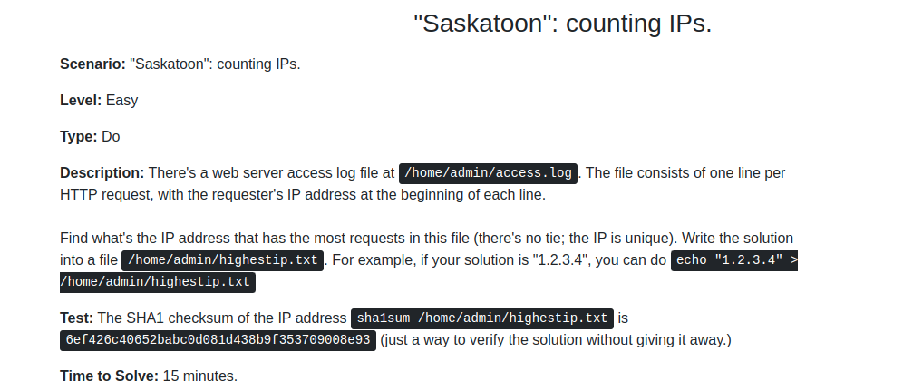
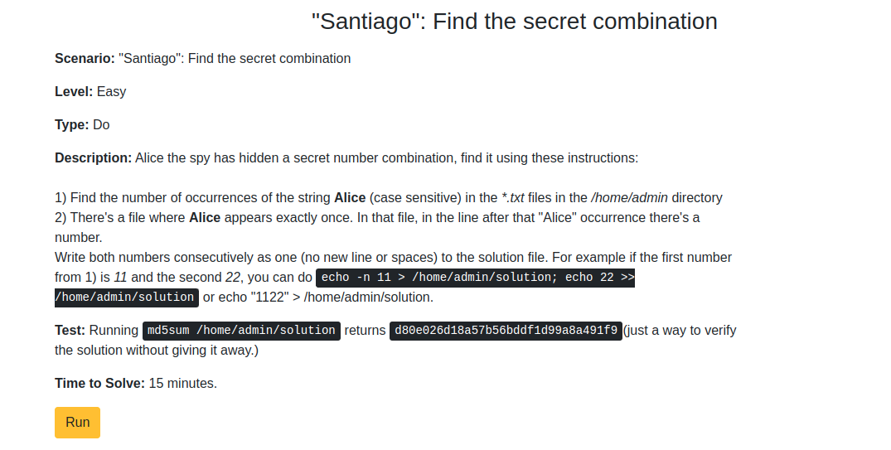

# Troubleshooting Scenarios

## Easy


```bash
lsof -f | grep bad.log
kill <process_id>
```



```bash
more_repeat_ip=$(cut -f 1 -d " " /home/admin/access.log | sort | uniq -c | sort | tail -n 1)
echo $more_repeat_ip | cut -f 2 -d " " > /home/admin/highestip.txt
```



```bash
cd /home/admin
grep Alice *.txt | wc -l #return 411
grep Alice *.txt | cut -f 1 -d "." | sort | uniq -c | sort #file is 1342-0
grep -A 1 Alice 1342-0.txt #return 156 (-A 1 is next line from grep)
echo -n 411 > /home/admin/solution; echo 156 >> /home/admin/solution
```